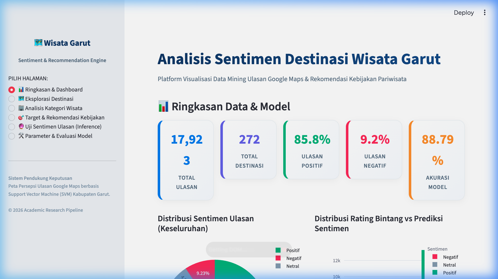
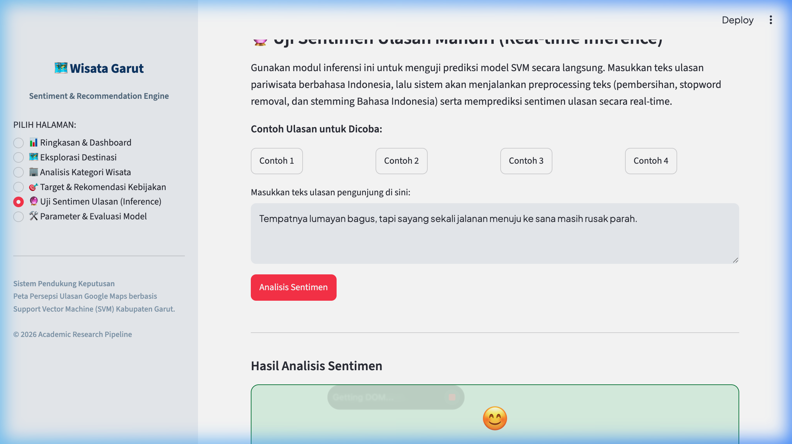
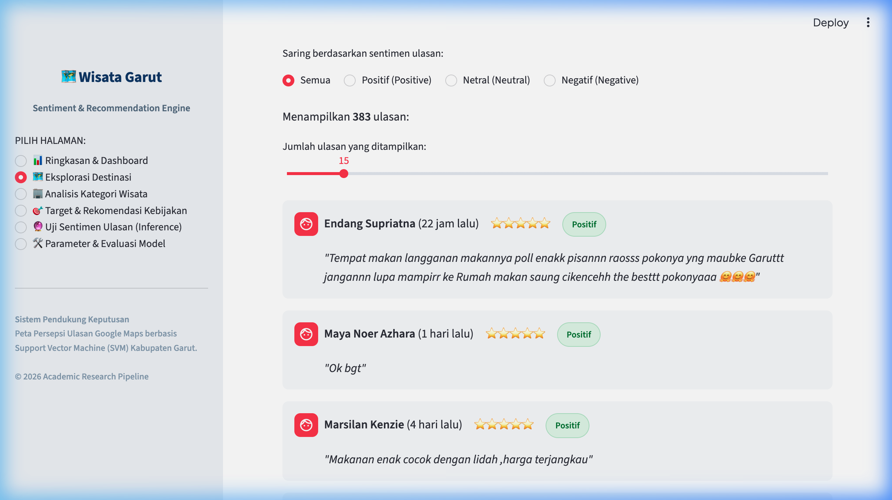
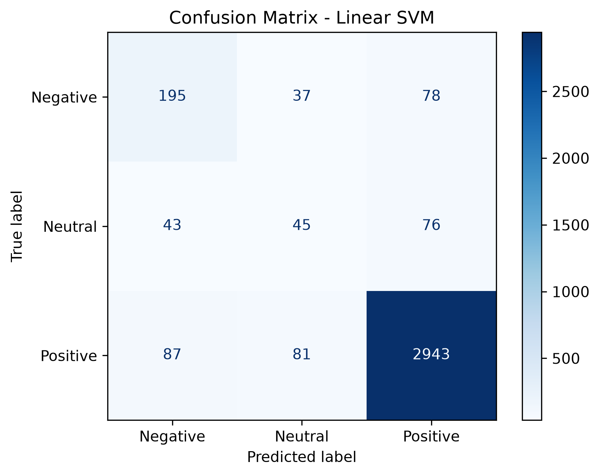
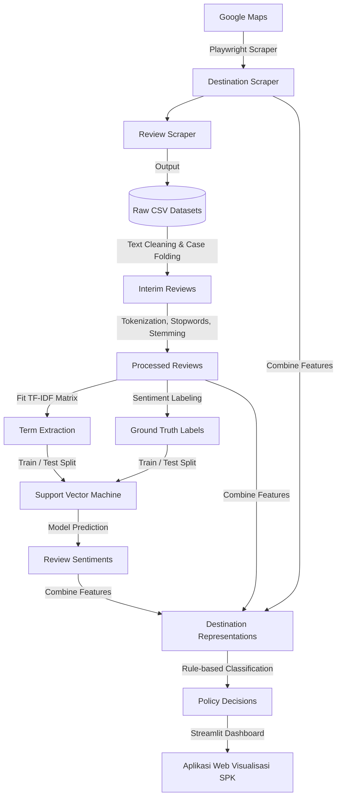

# Rekomendasi Destinasi & Analisis Sentimen Wisata Kabupaten Garut

Repositori ini berisi pipeline *Data Mining* dan aplikasi web interaktif (*Streamlit Dashboard*) untuk analisis sentimen ulasan Google Maps serta pemetaan rekomendasi kebijakan pariwisata di Kabupaten Garut, Jawa Barat. Proyek ini menggunakan algoritma **Support Vector Machine (SVM)** untuk klasifikasi sentimen ulasan dan pendekatan *rule-based decision* untuk merekomendasikan target kebijakan dinas pariwisata.

---

## 📸 Antarmuka Dashboard Streamlit

Berikut adalah tampilan aplikasi web interaktif yang dikembangkan untuk memvisualisasikan data ulasan, analisis performa model, dan hasil pemetaan kebijakan:

| Dashboard Utama | Playground Uji Sentimen Real-Time |
| :---: | :---: |
|  |  |

| Penjelajah Ulasan Destinasi | Confusion Matrix Model |
| :---: | :---: |
|  |  |

---

## 🎯 Fitur Utama Aplikasi

1. **Scraping Ulasan Google Maps**:
   - Menggunakan Playwright untuk mengambil data ulasan dan rating destinasi pariwisata di Garut secara dinas/akademis.
2. **Preprocessing Teks Bahasa Indonesia (NLP Pipeline)**:
   - Pembersihan teks (*Cleaning*): Menghapus emoji, simbol, angka, URL, tanda baca, dan spasi ganda.
   - Penyelarasan Huruf (*Case Folding*): Mengubah teks menjadi huruf kecil (*lowercase*).
   - Pemecahan Kata (*Tokenization*): Memecah kalimat menjadi token kata.
   - Penyaringan Kata Umum (*Stopword Removal*): Menghapus kata-kata umum Bahasa Indonesia menggunakan pustaka NLTK.
   - Pengubahan Kata Dasar (*Stemming*): Menggunakan algoritma Sastrawi untuk mencari kata dasar dari kata berimbuhan.
3. **Klasifikasi Sentimen (Linear SVM)**:
   - Pelatihan model biner/multikelas (Positif, Netral, Negatif) menggunakan pembobotan fitur **TF-IDF (Unigram & Bigram)**.
   - Penyeimbangan bobot kelas (*balanced class weights*) untuk menangani data tidak seimbang (*imbalanced dataset*).
4. **Analisis Kebijakan Prioritas Wisata**:
   - Mengelompokkan destinasi wisata ke dalam 4 prioritas kebijakan secara objektif:
     * **Promotional Priority (Promosi)**: Destinasi dengan kepuasan publik tinggi (Ulasan Positif ≥ 70%, Rating Rata-rata ≥ 4.0, Total Ulasan ≥ 10).
     * **Intervention Priority (Intervensi)**: Destinasi dengan tingkat ketidakpuasan tinggi (Ulasan Negatif ≥ 15%, Total Ulasan ≥ 10).
     * **Monitoring / Improvement Priority (Pemantauan)**: Destinasi dengan kepuasan moderat atau ulasan cenderung netral.
     * **Insufficient Evidence (Data Kurang)**: Destinasi dengan ulasan terlalu sedikit (< 10 ulasan) untuk dievaluasi secara statistik.
5. **Dashboard Visualisasi Interaktif (Streamlit App)**:
   - Ringkasan KPI data ulasan & akurasi model.
   - Grafik interaktif Plotly (Pie chart sentimen keseluruhan, rating vs sentimen).
   - Penjelajah Ulasan Destinasi: Memilih tempat wisata tertentu untuk membaca ulasan asli lengkap dengan label prediksi sentimen dan rating.
   - Analisis Kategori: Membandingkan performa sentimen antar jenis wisata (Kafe, Hotel, Pantai, dll.).
   - Uji Sentimen Ulasan (*Inference Playground*): Masukkan teks ulasan khusus untuk melihat hasil preprocessing dan prediksi sentimen secara real-time.

---

## ⚙️ Cara Instalasi & Penggunaan

### 1. Kloning Repositori
```bash
git clone <repository-url>
cd Garut-Tourism-Reccomendation
```

### 2. Buat dan Aktifkan Virtual Environment
Di macOS/Linux:
```bash
python3 -m venv .venv
source .venv/bin/activate
```
Di Windows:
```cmd
python -m venv .venv
.venv\Scripts\activate
```

### 3. Instal Dependensi
```bash
pip install -r requirements.txt
```

### 4. Unduh Korpora NLTK (Stopwords)
Jalankan perintah python singkat berikut untuk memastikan korpus stopwords terunduh:
```bash
python -c "import nltk; nltk.download('stopwords')"
```

---

## 🚀 Cara Menjalankan Aplikasi

### A. Menjalankan Pipeline Model (Training & Evaluasi)
Untuk memproses ulang data ulasan mentah, melatih model Linear SVM, mengevaluasi kinerja, dan mengekspor berkas ringkasan kebijakan ke folder `data/final/`:
```bash
python main.py
```

### B. Menjalankan Dashboard Visualisasi (Streamlit Web App)
Untuk membuka dashboard interaktif di browser Anda:
```bash
streamlit run app.py
```
Aplikasi akan secara otomatis terbuka di peramban web Anda di alamat **`http://localhost:8501`**.

---

## 📊 Hasil Evaluasi Model SVM

Kinerja pengklasifikasi teks Linear SVM pada Test Set (pembagian data 80:20):
- **Akurasi Model**: **88.79%**
- **Macro F1-Score**: **0.6125**
- **Weighted F1-Score**: **0.8885**

Laporan klasifikasi rinci per kelas sentimen:

| Kelas Sentimen | Precision | Recall | F1-Score | Jumlah Sampel |
| :--- | :---: | :---: | :---: | :---: |
| **Negative (0)** | 0.6000 | 0.6290 | 0.6142 | 310 |
| **Neutral (1)** | 0.2761 | 0.2744 | 0.2752 | 164 |
| **Positive (2)** | 0.9503 | 0.9460 | 0.9481 | 3,111 |

*Visualisasi Confusion Matrix untuk mengevaluasi bias model tersedia di berkas [`assets/confusion_matrix.png`](assets/confusion_matrix.png).*

---

## 🔄 Alur Kerja Pipeline Penelitian


